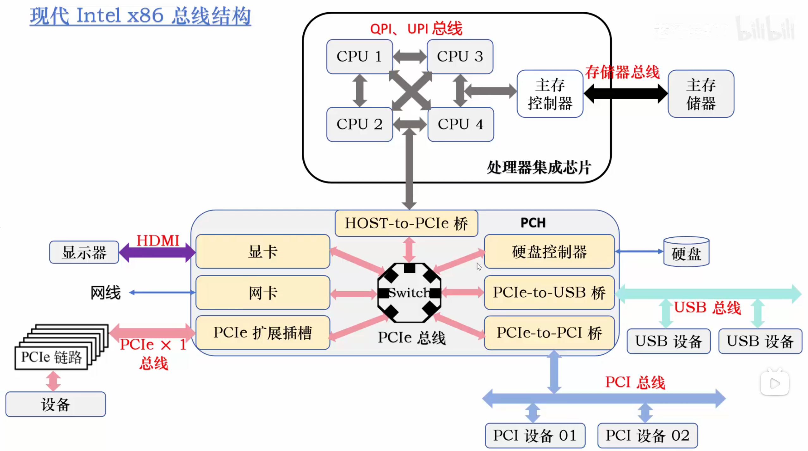
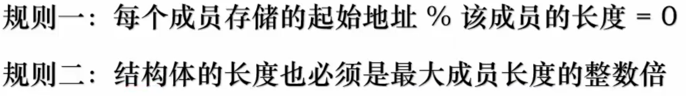

#+OPTIONS: ^:{}

* Basis
1. 2 <=> 8 <=> 16
2. How instructions is designed and executed ?
3. von Neumann architecture (five characteristic)
4. How a high-level program being compiled and executed ?
5. The abstraction competence
6. MOS -> Gates -> Hardwares
7. Architecture: Hardware <-- Microcontrol --> ISA <-- OS --> Applications
8. Frequency, Cycles, CPI
9. IPS(MIPS), Benchmark, Amdahl(optimized-ratio / improve + other-ratio)

* Bus System
1. analog and digit; continual and discrete; parrallel and serial
2. Band width = number of channels * working freq; working freq = Bus clock freq * times per cycle;(Bus clock is inequal to CPU clock)
3. Bus arbitration(decide on which device will use the BUS) <<arbitration>>
   Master/slave: if can control the bus
   - Focused
     + linked, sequential, simple
     + timer
     + independent, log_{2}N
   - Distributed
     each device have one arbitrator, 2N
4. Bus transaction cycle and transfer cycle
   Time consumed by one transaction which includes:
   - Bus allocation [[arbitration]]
   - Address
   - Data transfer
   - Release control

   We call the last three transfer cycle.
5. Bus Time Sequential
   - sync
   - async(full-lock, no-lock, semi-lock)
   - semi-sync(slave can send WAIT signal to indicate data haven't been ready)
   - separating(master will release the control after address been sent to slave)
6. Data transfer way
   (parrallel, serial) x (sync, async)

   sync serial:
   - another cycle signal
   - embeding time clock

   async serial:
   - Frame: begin bit, stop bit, parity check ...
   - Baud rate, bit rate

   Burst transfer: you can transfer multiply data bytes at one data transfer cycle.
7. Bus architecture
   ISA -> PCI -> PCIe view this video: https://www.bilibili.com/video/BV1n4411m7HX/
   
   Traditional: processor chip + north bridge + south bridge
   
   Modern: 

* [[https://en.wikipedia.org/wiki/Computer_memory][Main Memory]] [fn:1]
1. Digit logic circuit: description -> truth table -> sum of multiply(* <=> AND, + <=> OR) -> PLA(Programmable Logic Array)
2. decoder(138), MUX(multiplexer), [[https://www.bilibili.com/video/BV1efLQzZECs/][Latch]](RS Latch[Reset and set]), [[https://www.bilibili.com/video/BV1Ur7PzQEFr][edge-triggered]] -> staged [[https://www.bilibili.com/video/BV1efLQzZECs/][Register]](about 20-24 transistor), cache(6MOS) 
3. Machine word length ~= bits of GPR (will be corrected later)
4. ROM: MROM, PROM(only once write), EPROM(light), EEPROM(electron) :=> only the storage unit is different, Flash memory(...)
5. two dimensional: XY-decode
6. DRAM refresh policy: all-in-one, discrete, async(the combination of last two)
7. The difference between DRAM and SRAM
8. CPU -> MM controller -> MM
9. MM capactiy extension: capactiy = storage wordline * number of word => extend bitlen or extend wordlen
10. SDRAM(synchronous) and burst data transfer
11. Address by byte | Address by word
12. [[https://www.bilibili.com/video/BV1UB46eWE1X/][cache]]

* Numeric
1. encoding, unsigned, signed(main) := origin, two's complement, one's complement
2. zero extension, sign extension, unsigned int = (unsigned) (int), bit cut
3. fixed-pointing and [[https://pages.cs.wisc.edu/~david/courses/cs552/S12/handouts/goldberg-floating-point.pdf][float-pointing]]
4. memory order and memory align
   
5. ECC (SEC/DEC): check the book /interface/ Dependable Memory Hierarchy chapter and [[https://www.bilibili.com/video/BV1PT4y1a7Sv][this video]], *you can don't figure out this here, but you will face it at the computer network*, btw, network will occur the burst error in frame because the unreliable medium so will need *CRC*.
6. arithmetic and logic operations
7. full adder, CLA(compute the carry_{n}), OF(three implementation), *PSWR(Program Status Word Register)/CCR(Condition Code Register)*
8. multiply and divide (too hard, not very clearly)

* Footnotes

[fn:1] For more information, view the fifth chapter of book hardware-software-inteface about all storage devices.
