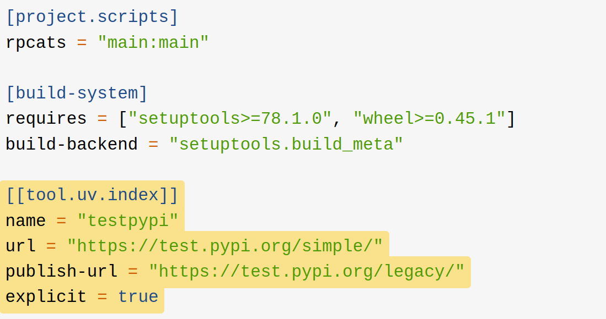

#+AUTHOR: doodo
#+EMAIL: 2901652008@qq.com
#+TITLE: First try on `uv`

* uv is a all-in-one python manager(Attention: no package) based on =Rust=

* Common usage
** uv --version : name explained
** uv self update : check for new version and get it 
** uv run
** uv add [--dev] [--upgrade] <package> [-r requirements]
** uv upgrade 
** uv remove
** uv pip list/install [-i /source url/ ]
** uv lock/sync
** uv build --sdit/-wheel
** uv publish --index <index> --token <token>
 #+CAPTION: example from realpython.com
 #+ATTR_ORG: width 500px
 
