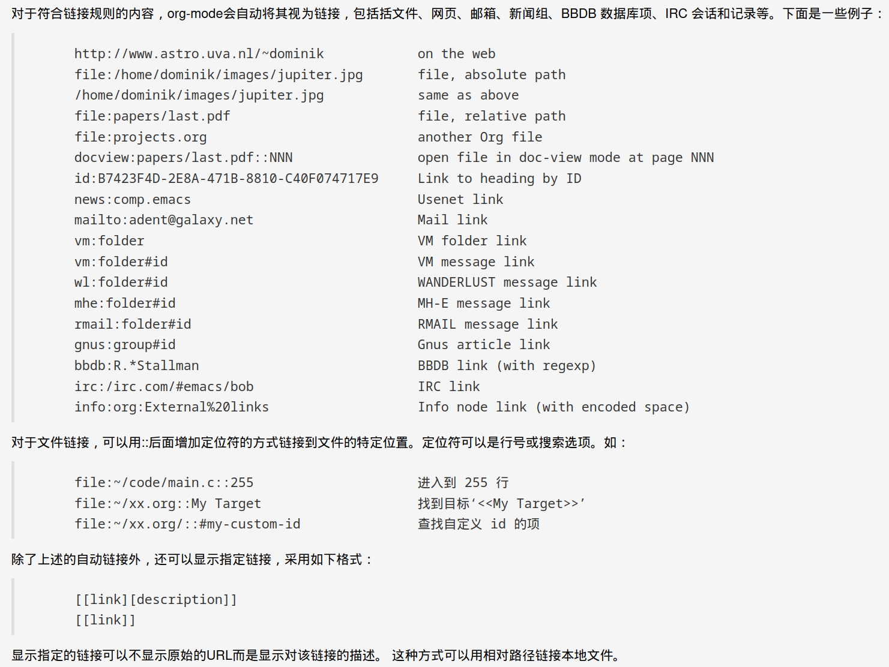

#+TITLE: The Usage of Org-mode
#+AUTHOR: Doodo
#+EMAIL: 2901652008@qq.com
#+DATE: <2026-04-28 Tue>

* Before everything
    In Org-mode, we use * to present headings just like #
    in Markdown. Instead of using everything in Org-mode
    I choose to just learn what I need. This is not very
    precise, because if there are some boring time I will
    want to learn some useful tricks. Whatever, no matter
    what I will learn about Org-mode, it will be recorded
    here.
    
    
* Basic Format
    1. usually
       + **Bold**
       + /Italic/
       + +deleteline+
       + _underline_
       + ordered and unordered list(you have seen)
    2. math
       - E = mc^2
       - a_i, b_i
    3. others
       * =Mono=

* Shortcuts
    1) (S-)TAB cycle current chapter(all file)'s states
       (fold->unfold next level->completely unfold)
       
    2) C-c C-n/C-p jump between headings.
    3) C-c C-u same level, C-c C-u improve level
    4) C-c C-j browser precis
    5) M-RET/M-S-RET insert a same level (TODO)heading
    6) C-c l/C-c C-l/C-c C-o store/insert/open link
    7) C-c C-q add tags
    8) C-c C-e export
    9) C-c C-d insert deadline
    10) C-c C-x f insert a footnote or type C-c C-c will jump at footnote and text #<<footnote-usage>>
    11) C-c . create a timestamp 
    12) C-c C-, insert a block
    13) C-c C-x C-h for help documennt

* Table
Just type | name1 | name 2 | ... | is OK
Shortcuts:
+ C-c | create/convert a table
+ TAB/S-TAB next region(RET next line), create if necessary
+ M(-S)-LEFT/M(-S)-RIGHT M-UP/M-DOWN move(delete) column/row
+ C-c - add horizontal line at next line
+ C-c ^ sort according to current column 

try :
|------------------+-------|
| subject          | level |
|------------------+-------|
| Computer Science | ***** |
| English          | ****  |
| Mathmetics       | ***** |
|------------------+-------|

* Image and LaTeX
See \ref{label-example}

#+CAPTION: an example also the note of link usage
#+LABEL: label-example
#+ATTR_ORG :width 50

LaTeX is worthy consuming more time, I have used it a period.
So I just put the [[https://orgmode.org/manual/Embedded-LaTeX.html][official manual]] here.

* Metadata
Insert a raw text you can use _block_ syntax or add a ':' at start of line
#+BEGIN_EXAMPLE
#+TITLE:       the title to be shown (default is the buffer name)
#+AUTHOR:      the author (default taken from user-full-name)
#+DATE:        a date, an Org timestamp1, or a format string for format-time-string
#+EMAIL:       his/her email address (default from user-mail-address)
#+DESCRIPTION: the page description, e.g. for the XHTML meta tag
#+KEYWORDS:    the page keywords, e.g. for the XHTML meta tag
#+LANGUAGE:    language for HTML, e.g. ‘en’ (org-export-default-language)
#+TEXT:        Some descriptive text to be inserted at the beginning.
#+TEXT:        Several lines may be given.
#+OPTIONS:     H:2 num:t toc:t \n:nil @:t ::t |:t ^:t f:t TeX:t ...
#+BIND:        lisp-var lisp-val, e.g.: org-export-latex-low-levels itemize
               You need to confirm using these, or configure org-export-allow-BIND
#+LINK_UP:     the ``up'' link of an exported page
#+LINK_HOME:   the ``home'' link of an exported page
#+LATEX_HEADER: extra line(s) for the LaTeX header, like \usepackage{xyz}
#+EXPORT_SELECT_TAGS:   Tags that select a tree for export
#+EXPORT_EXCLUDE_TAGS:  Tags that exclude a tree from export
#+XSLT:        the XSLT stylesheet used by DocBook exporter to generate FO file
#+INCLUDE      same as C include that include a file, `#+INCLUDE "path" src python`
#+STARTUP      global settings: inlineimages
#+END_EXAMPLE
: #+BEGIN_SRC <language> <-n linenumber> <-h height> <-w width>
Some optional in **OPTIONS**:
#+begin_example
H:         set the number of headline levels for export
num:       turn on/off section-numbers
toc:       turn on/off table of contents, or set level limit (integer)
\n:        turn on/off line-break-preservation (DOES NOT WORK)
@:         turn on/off quoted HTML tags
::         turn on/off fixed-width sections
|:         turn on/off tables
^:         turn on/off TeX-like syntax for sub- and superscripts.  If
           you write "^:{}", a_{b} will be interpreted, but
           the simple a_b will be left as it is.
-:         turn on/off conversion of special strings.
f:         turn on/off footnotes like this[1].
todo:      turn on/off inclusion of TODO keywords into exported text
tasks:     turn on/off inclusion of tasks (TODO items), can be nil to remove
           all tasks, todo to remove DONE tasks, or list of kwds to keep
pri:       turn on/off priority cookies
tags:      turn on/off inclusion of tags, may also be not-in-toc
<:         turn on/off inclusion of any time/date stamps like DEADLINES
*:         turn on/off emphasized text (bold, italic, underlined)
TeX:       turn on/off simple TeX macros in plain text
LaTeX:     configure export of LaTeX fragments.  Default auto
skip:      turn on/off skipping the text before the first heading
author:    turn on/off inclusion of author name/email into exported file
email:     turn on/off inclusion of author email into exported file
creator:   turn on/off inclusion of creator info into exported file
timestamp: turn on/off inclusion creation time into exported file
d:         turn on/off inclusion of drawers
#+end_example

--------
(At least five '-' will give a separate line)
* Reference
At the same time to list the reference, it is a good chance to show how
to do the reference. We have talked about how to add [[footnote-usage][footnote]](this is a usage of anchor).
1. [[https://www.cnblogs.com/qlwy/archive/2012/06/15/2551034.html][cnblogs(introduction to org-mode)]]
2. [[https://www.cnblogs.com/holbrook/archive/2012/04/12/2444992.html][cnblogs(emacs learning notes)]]
3. [[https://orgmode.org/manual/Citation-handling.html][Here are also some more powerful citation way]](I don't want to add them directly now
   becasue I have talked we just add what we can do in practice now)
