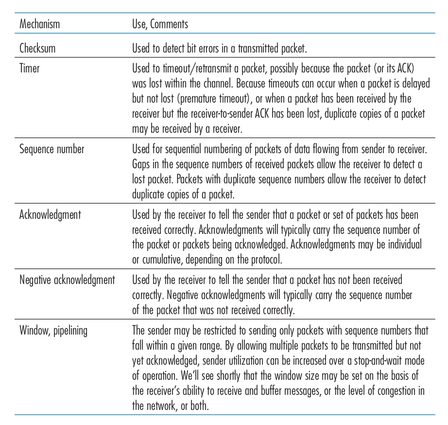

#+TITLE: Transport Layer
#+DATE: <2026-04-28 Tue>
#+AUTHOR: Doodo
#+EMAIL: 2901652008@qq.com

* Two goals
 + reliably transmission
 + congestion control

* Introduction
 1. application(message) -> transport(segment) -> network(datagram; packet)
 2. router doesn't have a role in this layer
** Relationship with *Network Layer*
 + Network layer(NL) give a communication between *hosts*
 + Transport layer(TL) give a communication between *processes*
 + NL must provide *delay* and *bandwidth* guarantees.
** Overview
 The basic function of TL is extending the dilivery service provided by NL, which is called /multiplexing/ and /demultiplexing/. But TCP and UDP have differences. The later just implements p2p delivery and error checking. But more advanced functionality like congestion control and reliably delivery are implemented in TCP.
 
* Multiplexing and Demultiplexing
Imagine NL as a pipe, there are many streams, *HOW* to separate them. So the TL must add some metadata -- headers -- to help. This is *port*. UDP just use a two-tuple(dst address and dst port) while TCP use a four-tuple. TL will direct different tuple-flagged segment to differen *socket*. There is no one-to-one correspondence between socket and process. One process can spawn many threads which will have their own socket.

* Connectionless Transport: UDP
#+NAME: UDPClient.py
#+BEGIN_SRC python
  from socket import *
  serverName = 'hostname'
  serverPort = 12000
  clientSocket = socket(AF_INET, SOCK_DGRAM)
  message = input('Input lowercase sentence:')
  clientSocket.sendto(message.encode(), (serverName, serverPort))
  modifiedMessage, serverAddress = clientSocket.recvfrom(2048)
  print(modifiedMessage.decode())
  clientsocket.close()
#+END_SRC
#+NAME: UDPServer.py
#+BEGIN_SRC python
  from socket import *
  serverPort = 12000
  serverSocket = socket(AF_INET, SOCK_DGRAM)
  serverSocket.bind('', serverPort)
  print("The server is ready to receive")
  while True:
      message, clientAddress = serverSocket.recvfrom(2048)
      modifiedmessage = message.decode().upper()
      serverSocket.sendto(modifiedmessage.encode()), clientAddress)
#+END_SRC

** UDP won't disturb you before he do it, that is /connectionless/, *TCP is not always preferable for UDP* for these reasons:
- Some real-time applications can tolerate some loss, they can implement some additional functionalities in application layer based on UDP.
- UDP don't need to spend resources in establishing connection. Indeed, google's Chrome use QUIC to achieve _reliablity_ in application layer.
- UDP don't need to maintain /state/ and /prameters/ when communicating.
- Small packet header overhead.

Besides the reliablity of TCP, _congestion control_ is also an important point.
Muchmore, it's possible to have reliable data transfer when using UDP.(QUIC).
** UDP Segment Structure
- header: 4 * 2bytes(src port, dest port, length=header+data, checksum)
- data field: query/response message
** UDP Checksum
 [[https://www.rfc-editor.org/rfc/rfc1071][RFC 1071]]
 Some link layer also implement error detection but it's still need to implement it in UDP according to [[https://cio-wiki.org/wiki/End-to-End_Principle][end-end principle]]

* Principles of Reliable Data Transfer
 Just look the book corresponding chapters to see how build a rdt protocol. Here just are some overviews.
 - one-state -> stop-and-wait protocols -> alternating-bit protocol -> pipelining
 - ARQ(Automatic Repeat reQuest) protocols: if the sender receive an negative acknowledgments, it will automatically resend the packet. For implementing this protocol, three components are necessary:
   + Error detection: decide if receiver need to send a NAK
   + Receiver feedback: positive(ACK) and negative(NAK) acknowledgments. Indeed, NAK can be replaced by *duplicate ACKs*.
   + Retransmission
 - GBN(Go-Back-N)/sliding-window protocol: cumulative acknowledgment is important
 - SR(Selective Repeat): in order to improve the performance of GBN
   #+CAPTION: Summary of rdt mechanisms and their use
   #+LABEL: sum_of_mechanisms
   #+ATTR_ORG: :width 500px
   
 - sequence number reordering problems

* Connection-Oriented Transport: TCP
Reference Documentation: [[https://www.rfc-editor.org/rfc/rfc793][RFC 793]],[[https://www.rfc-editor.org/rfc/rfc1122][RFC 1122]],[[https://www.rfc-editor.org/rfc/rfc2018][RFC 2018]],[[https://www.rfc-editor.org/rfc/rfc5681][RFC 5681]],[[https://www.rfc-editor.org/rfc/rfc7323][RFC 7323]]
** The TCP Connection
+ Before two processes can communicate, they must connect first.
+ In order to establish a connection, TCP will use three special segments. So the process of connection is also called /three-way handshake/.
+ MSS(maximum segment size, no headers) vs MTU
+ TCP connection consists of two sets of _buffers_, _variables_ and _socket_.
** TCP Segment Structure
- sequence number: number from 0 to N, this number is the bytes' index.
- acknowledgment number: receiver expected sequence number.
- cumulative acknowledgments: only acknowledge bytes up to the first missing.
- Header length: there are option headers in TCP segment.
- flags:
  + CWR,ECE -> congesiton control
  + +URG -> urgent segment, worked with *Urgent data pointer*+
  + +PSH -> acknowledge receiver upper-layer push now+
  + ACK -> together with *Acknowledgment number*
  + RST,SYN,FIN -> connection setup and teardown
- piggybacked
- even data field is empty, the segment still need a sequence number
** RTT Estimation and Timeout
 Set a appropriate timeout for timeout/retransmit mechanism
 - EstimatedRTT = (1 - \alpha)*EstimatedRTT + \alpha*SampleRTT (RFC: \alpha = 1/8). This average is called EWMA(Exponential Weighted Moving Average) in statistics
 - DevRTT = (1 - \beta)*DevRTT + \beta*|SampleRTT - EstimatedRTT| (RFC: \beta = 1/4)
 - TimeoutInterval = EstimatedRTT + 4*DevRTT
** RDT
- Double the TimeoutInterval when timeout is triggered
- [next time] Reread the fast retransmit part 
